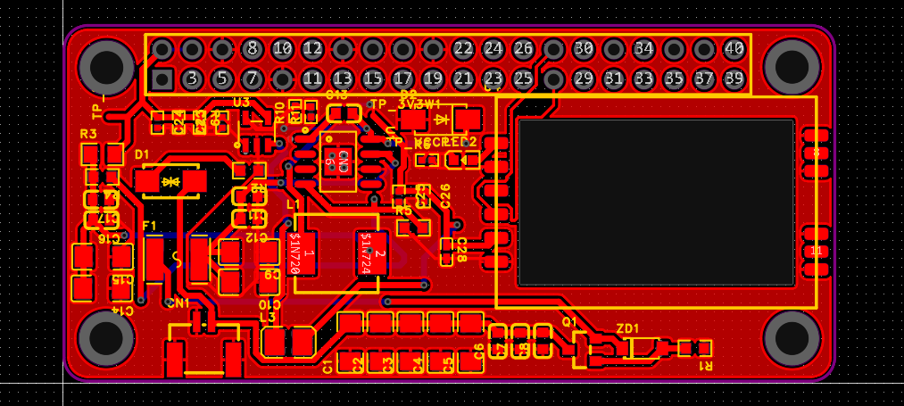

# July - A FPV Monitor
## July 5th
I named it July, cause why not. July is a 1080p Touch screen dual antenna SOM based device that can run software to easily access OpenIPC video stream from the Eachine sphere link. Open source and easy to use, just turn it on, connect to pixel pilot and done! 

Easily one of the most poweful and long range FPV monitors out there. There aren't many out there too y'know. 

Researched a lot on OpenIPC tech, the CM5, Raxda, RTL8812AU wifi modules and a lot of things. Here is a brief summery of it all.

### Brains, yes, a monitor needs a brain too
I've decided its best to use a SOM (System on Module).
- well, I could use a SBC like RPI Zero 2 W, but that would be tedious to put on a PCB, then the connections from it would need to be hacked to support everything.
- another option is a CM5 board, reletively easier to put on a board and do all the stuff

After reading through the docs at OpenIPC's website and github, I have come to the conclusion that the Radxa ZERO 3W is the recommended SBC for a ground station.
> #### What is a Ground station?
> A ground station is a place from where the drone is being controled and supervised, it recieves all* the radio comms from the drone and proceeses it for the controller to get enough infomation about the whereabouts of the drone.

It's an epic SBC, and it's actually most recommended for this (being a ground station)

But as you can see, its unmountable on a PCB so we gotta improvise, lets think 🤔

Ah ha! We can use the GPIO and connections (USB and DSI connectors) for the connections to required modules.
Now with our SBC decided, lets select our WIFI 5GHz module
> random note: I currently have at least a 100 chrome tabs open and more than 50% of those are aliexpress and alibaba sites :help:

So, after reading a lot of docs and talking with some people associated with the hobby, who are much more experienced than me, I found out that these are my current options:
- RTL873xBU
- RTL8812AU
	- BL-R8812AF1  (uses the above chip)
- RTL8812EU
	- BL-M8812EU2 (uses the above chip)

So let's remove RTL873xBU from the list, why?
- it's tiny, hence very low power, it might be fine for tinywoops but not for long range builds like this

well, moving on to RTL8812AU, let's see:
- its a oldie in this community, hence proven 
- a bit expensive
- It is said to have exceptional performence

That sounds nice, let's discuss our last one and get back to this

last but not the least, RTL8812EU:
- it's new, unproven but at this point we can probably call it middle aged? idk
- cheap, very.
- It works, it's great for transmit bit, but fine for recieving I guess, the transmit powers are impressive tho, 800mW!

I guess we have our winner! It's RTL8812AU!
We'll try to quickily find a suitable board that supports this chip to attach in the monitor along with the SBC.

Found it, just took half an hour, this sheet dosen't do justice to the time spent searching for stuff.

This is it! we got it.
This is a RTL8812AU based network card that we're gonna connect. It's powerful and will help us recieve the signals.

> remember this random Aliexpress coupon i found FSUK06, SBPWMFT3LE95 (navarcer audio)

That's it for now, let's think what more do we need.

## July 6th

Good Morning! (Good evening or Good night) choose your greeting based on when you're reading this, (I missed out on Good afternoon but who'd read this at noon, i usually take a nap then /jk)
Got some good news and some bad news. Bad News first: We can't use the Raxda Zero 3W, it laggy laggy, it doesn't have enough power for what we want to do. As some people with more experience have informed, that would not be the best way to go forward with this. 
Good news: they also recommended the way to actually go forward with this, behold the Radxa ROCK 4D 

About the Raxda 4D, it's a capable SBC which can do a lot of things, the things which interest us are it's processing abilities and GPU power in which it excels enough.
So that's what we're going to use.

I am writing this blog 'after the fact' so I am going to miss some research, but it is what it is. 

Well, talking about being what it is, we need to select more stuff, we need to get the monitor, power supply, make the wiring diagram for all of this.
Before that, let's select the special antennas we need for this
For our medium range goals we need an antenna with at least 10+ dBi gain to get the video signal.
After scouring Aliexpress for hours, I think I have found one that'll actually work.

This thing is a 17dBi gain linearly polarized antenna capable to listening in to the faintest signal. Along with this, I got a 8dBi omni directional antenna should the drone go out of the field of view of this antenna.

Here's an accounting sheet for the project, it contains all the parts I have ordered in relation to it, by all, I actually mean all, even the itty bitty ones.
You can check it out [here](https://docs.google.com/spreadsheets/d/1skVhD2z50aWqVVDrjqqTZmjcNkN75A2qXTNfnrAGnOc/edit?usp=sharing).

Now that we have this antenna too, let's discuss some more about the monitor itself, first of all, we need an monitor

found one, this is a one cheap excellent display, it is a 7" display and prefectly fits in our monitor case.

time spent: ~4-5 hrs

## July 7th
Hello again, good to see you back here. Let's make a rudementry design for the whole thing (with all the parts)

Yep, that's the plan, and there's a battery in the back (it'll be a 10000mAh powerbank I have)

that's it for the physical stuff I think.

Now let's talk software. Geez, it's been long, finally I can close the AliExpress tabs. Wait a moment, I gotta close a few chrome windows.
*angry chrome noises*
ya, let's get to discussing software.

The FPV Camera uses OpenIPC, which is a protocol made initially for easy viewing with IP cameras which hobbiesyt quickly modifed to work with drones. At the basic level, it uses WFB-ng which is the next generation of long range packet radio based on the wifi radio.

a snippet directly from the px4 docs
>## WFB-ng Overview
>
> The  _WFB-ng project_  provides a data transport that use low-level WiFi packets to avoid the distance and latency limitations of the ordinary IEEE 802.11 stack.
>
>The high level benefits of  _WFB-ng_  include:
>
>-   Low-latency video link.
>-   Bidirectional telemetry link (MAVLink).
>-   TCP/IP tunnel.
>-   Automatic TX diversity - use multiple cards on the ground to avoid antenna tracker.
>-   Full link encryption and authentication (using  [libsodium](https://doc.libsodium.org/)).
>-   Aggregation of MAVLink packets (pack small packets into batches before transmitting).
>-   Enhanced  [OSD](https://github.com/svpcom/wfb-ng-osd)  for Raspberry PI or generic linux desktop with gstreamer.

In a gist, it helps us establish a TCP/IP tunnel from the drone to the Groundstation so we can stream video + telemetry. This is cool open source software which everyone should be able to access and hack for their own use. That's what makes it even more cooler.

As you'd see, I am using a RTL8812au (for receiving) which is in the [list of supported modules](https://github.com/svpcom/wfb-ng?tab=readme-ov-file#supported-wifi-hardware), so that's great!
For our Raxda pi we'd follow the basic guidelines and then start with our custom approach to modify settings for the best link reliability and bitrate.

time spent: ~4 hr

## July 8th

After reading OpenIPC docs in depth, I realized this is 
I should have known about it ages ago.

I am reading the OpenIPC installation docs (https://github.com/OpenIPC/wiki/blob/master/en/installation.md) to better understand it all.

Okay, after a lot of talking with more established community members, here is a snippet of what they said when i later went on to confirm my final selection of the stuff.

So, I guess we're back to the Raxda zero 3W, which is actually good news! It's apprently works more reliably and is cheaper too!
For people who forgot what the zero 3W looked like:

It's actually great as I already talked about in my july 6th entry. We're mainly interested in the processing power of the device and it's video decoding capabilities and the zero 3W has plenty of both. It uses a Rockchip RK3566 SoC which has the Quad‑core Arm® Cortex®‑A55 (Armv8) 64‑bit @ 1.6GHz and a Arm® Mali™‑G52‑2EE as GPU. Both good.

It has the HDMI port so that's what we're going to use to connect to the display.
Honestly tho, I might just resolder the HDMI connection pointing inwards, it's just at the edge so it kinda sucks, a cable outwards may work but let's see.

time spent: ~4 hrs

## July 9th

Let's make a custom RPI type uHAT to integrate this all into the Radxa Zero 3W easily.
The uHAT would act as our interface with the outside so we'd be adding a few buttons and a temp probe to it too.
An OLED screen would be nice too, it'll act as a status indicator for the device and show some basic info like IP address, temperature, battery level etc.
What else? A few LEDs to indicate the status of the device, like if it's on, if it's connected to the drone, if it's recording etc.

> extra note, midway through designing the uHAT, I realized that the uHAT can be actually also used as a adapter for a phone so it can be used with the pixelpilot app too, which is kinda RAD, even smaller footprint! Will definetly try to make it work with a phone too.
 

# June 15th

Did a lot of work in the last week, I realized that just custom designing everything is not efficient always BUT ITS THE BEST THING YOU CAN DO!

So I did, the HAT supports powering the zero 3W from a battery connection directly, connects the BL-R8812AF1 module with the computer and also powers it, acts as the main interface for the thing too (houses the buttons on a diff. board)
> random note: walmart sells these chips?! https://www.walmart.com/ip/RTL8812AU-BL-R8812AF1-Wireless-Module-1200M-Dual-Band-AC-Smart-Multifunction-Convenient-Wifi-High-Power-Module/5468431768

kinda took too long but happy that it's done.
this provides power to both the SBC and the BL-R8812AF1 module from the battery connection, connects the BL-R8812AF1 module to the SBC via USB GPIO. (remember to do the changes on the SBC to make it work with the USB GPIO)
