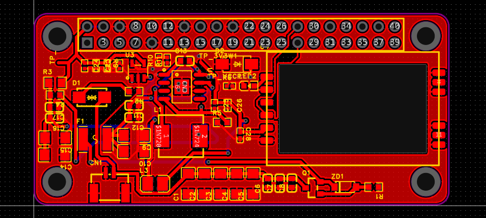
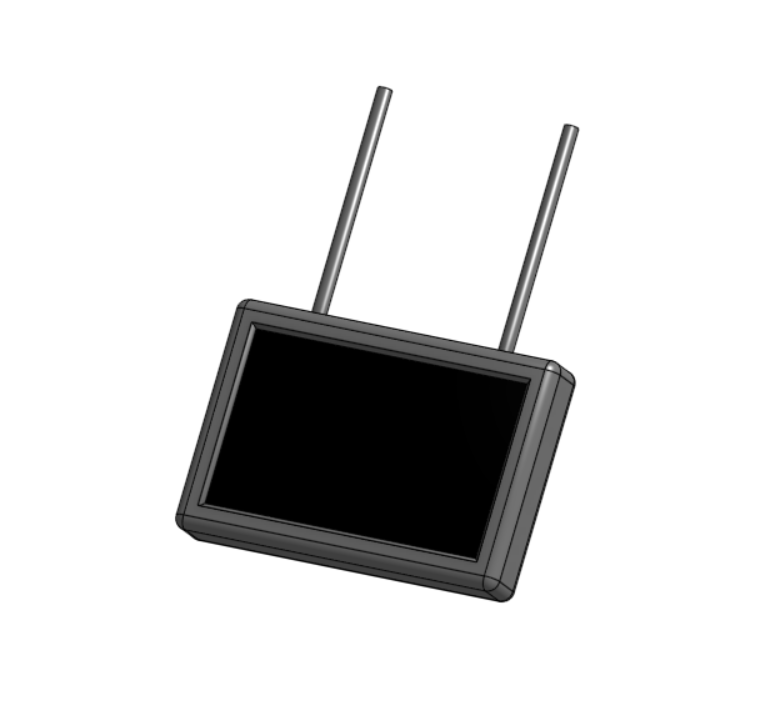
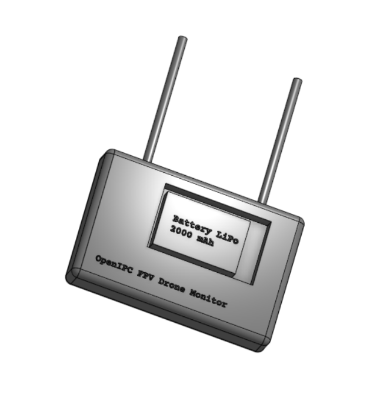

# July, The FPV Monitor

This is a custom monitor based on openIPC to stream video from the UAV. It is designed to be user-friendly and customizable, making it suitable for various UAV applications. It's designed to be more plug and play for the user so they can focus on flying rather than setting up the monitor. MIMO antenna is used to improve the signal quality and range, ensuring a stable video feed during flight. Cheap and easy to build, this monitor is perfect for hobbyists and professionals alike.

## Features
- **Video Streaming**: Stream video from the UAV to the monitor.
- **OpenIPC**: Based on the openIPC firmware for flexibility and customization.
- **Customizable**: Modify the firmware to suit your needs.
- **User-Friendly Interface**: Designed for ease of use with a simple interface.
- **Compact Design**: Lightweight and portable for easy transport.

## BOM
|Category        |Component Name       |Quantity|Unit Cost|Total Cost|Supplier|Link                                                              |
|----------------|---------------------|--------|---------|----------|--------|------------------------------------------------------------------|
|Screen          |Monitor              |1       |$25.18   |$25.18    |Generic |https://www.aliexpress.com/item/1005007432461342.html             |
|Case            |Fillament Generic PLA|1       |$10.00   |$10.00    |Generic |Local/Amazon                                                      |
|Battery         |2000 mAh li-ion      |1       |$10.30   |$10.30    |Tattu   |https://robu.in/product/11-1v-2000mah-3c-3s1p-li-ion-battery-pack/|
|SBC             |Raxda Zero 3W        |1       |$23.00   |$23.00    |Radxa   |https://shop.allnetchina.cn/products/copy-of-radxa-zero-3w        |
|Module          |LB Link RTL2AU       |1       |$11.52   |$11.52    |LB Link |https://www.aliexpress.com/item/1005006486060233.html             |
|PCB + Components|uHAT                 |1       |$13.00   |$13.00    |JLC PCB |jlcpcb                                                            |
|Misc.           |HDMI FPC Cable       |1       |$3.00    |$3.00     |Generic |                                                                  |
|Total           |                     |        |         |$93.00    |        |                                                                  |

